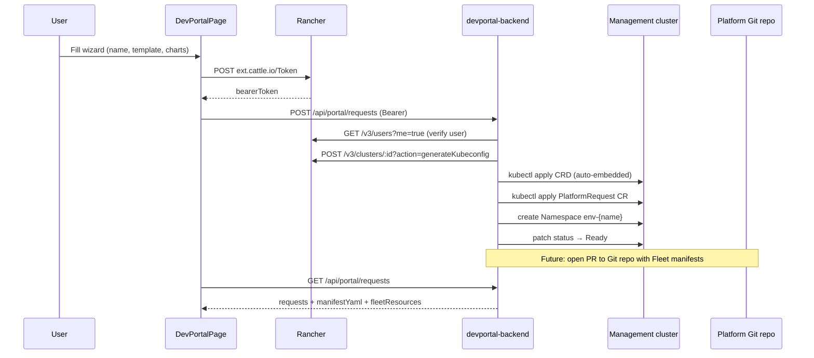

# Architecture

## Request flow



## PlatformRequest CRD

Each self-service request becomes a namespaced `PlatformRequest` in `devportal-system` (configurable via `PLATFORM_NAMESPACE`).

```yaml
apiVersion: platform.devportal.io/v1alpha1
kind: PlatformRequest
metadata:
  name: pr-my-team
  namespace: devportal-system
spec:
  name: my-team
  displayName: "My Team"
  template: team          # sandbox | team | vcluster
  charts:
    - rancher-monitoring
    - cert-manager
  requester: admin
status:
  phase: Ready            # Pending → Provisioning → Ready | Failed
  message: "Environment env-my-team is ready"
```

| Field | Purpose |
|-------|---------|
| `spec.template` | `sandbox`, `team`, or `vcluster` guardrails |
| `spec.charts` | Selected catalog chart IDs for Fleet delivery |
| `spec.requester` | Rancher username stamped at submit time |
| `status.phase` | `Pending` → `Provisioning` → `Ready` / `Failed` |

## Fleet GitOps plan

For `team` and `vcluster` templates, the backend plans these resources:

| Kind | Name | Purpose |
|------|------|---------|
| `Namespace` | `env-{name}` | Isolated environment namespace |
| `GitRepo` | `fleet-{name}` | Fleet sync from `environments/{name}/` |
| `Bundle` | `{chart}-{name}` | Per-chart Fleet bundle (one per selected chart) |

The Git repo root, branch, and Fleet namespace are configured via environment variables:

```
PLATFORM_GIT_REPO=https://github.com/your-org/platform
PLATFORM_GIT_BRANCH=main
PLATFORM_FLEET_NAMESPACE=fleet-default
```

Future automation will open a pull request to `PLATFORM_GIT_REPO` under `environments/{name}/` with the Namespace, GitRepo, and per-chart manifests.

## Templates

| Template | Namespace | Fleet GitRepo | Use case |
|----------|-----------|---------------|---------|
| `sandbox` | ✓ | — | Dev experiments, personal sandboxes |
| `team` | ✓ | ✓ | Team environments with GitOps chart delivery |
| `vcluster` | ✓ | ✓ | Isolated control plane (requires vCluster operator) |

## Kubeconfig resolution

The backend does **not** mount the host kubeconfig. Instead on first use it:

1. Calls Rancher `POST /v3/clusters/:id?action=generateKubeconfig`
2. Rewrites loopback/`0.0.0.0` server URLs to `rancher:443` (Docker network alias)
3. Sets `insecure-skip-tls-verify: true` (Rancher cert is for `localhost`, not `rancher`)
4. Caches the kubeconfig in-process

## Admin view

Users with `globalRoleBindings` of `admin` or username `admin` see:

- All platform requests (not just their own)
- Requester column, CR name, expandable manifest YAML and Fleet resources
- The planned Git PR path

## Separation from Krew Workstation

| | Krew Workstation | Developer Portal |
|--|------------------|------------------|
| Repo | `krew-workstation` | `rancher-devportal` |
| Product | Tools → Krew | Platform → Developer Portal |
| Backend port | 9000 | 9010 |
| Backend focus | Terminal, kubectl plugins, backups | PlatformRequest provisioning |
| CRD | — | `platformrequests.platform.devportal.io` |

Both extensions install independently on the same Rancher instance.

## Roadmap

| Layer | Current | Planned |
|-------|---------|---------|
| Namespace | Created synchronously | Resource quotas, NetworkPolicy templates |
| Fleet | Planned resources + hints | GitRepo + Bundle created; PR opened to Git |
| Virtual cluster | Template flag | vCluster operator integration |
| RBAC | Per-user request filter | Rancher Project/Namespace RBAC binding |
| Git PR | Hint only | Real PR against `PLATFORM_GIT_REPO` |
