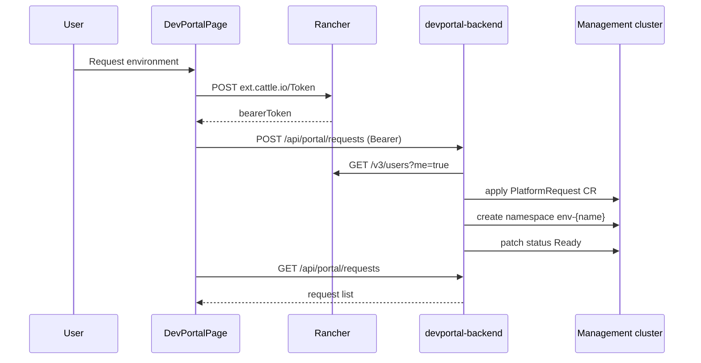

# Architecture

## Request flow

## PlatformRequest CRD

Each self-service request becomes a namespaced `PlatformRequest` in `devportal-system` (configurable via `PLATFORM_NAMESPACE`).

| Field | Purpose |
|-------|---------|
| `spec.template` | `sandbox`, `team`, or `vcluster` guardrails |
| `spec.charts` | Selected catalog chart IDs (Fleet delivery planned) |
| `spec.requester` | Rancher username |
| `status.phase` | `Pending` → `Provisioning` → `Ready` / `Failed` |

## Roadmap

| Layer | Current | Planned |
|-------|---------|---------|
| Namespace | Created synchronously | Quotas, NetworkPolicy templates |
| Fleet | Annotations only | GitRepo + Bundle per request |
| Virtual cluster | Template flag | vCluster / SUSE Virtual Clusters operator |
| RBAC | Per-user request filter | Rancher Project/Namespace RBAC binding |

## Separation from Krew Workstation

| | Krew Workstation | Developer Portal |
|--|------------------|------------------|
| Repo | `krew-workstation` | `rancher-devportal` |
| Product | Tools → Krew | Platform → Developer Portal |
| Backend | Terminal, krew, backups | PlatformRequest provisioning |
| Port (dev) | 9000 | 9010 |

Both extensions can be installed on the same Rancher instance independently.
