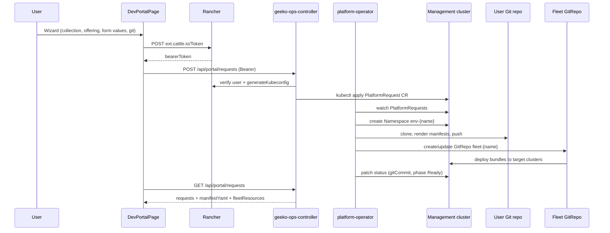

# Architecture

## Request flow



## Components

| Component | Role |
|-----------|------|
| **Geeko-Ops UI** | Catalog-driven wizard; admin catalog builder; manifest preview and status |
| **Geeko-Ops controller** | Auth, catalog API, offering resolution, CRD bootstrap (admin), creates `PlatformRequest` CRs |
| **platform-operator** | Reconciles CRs: namespace → Git push → Fleet GitRepo → status |
| **PlatformRequest CRD** | Desired state per environment request |
| **Fleet GitRepo** | Pulls `environments/{name}/` from user-provided Git repo |

## Catalog model

Platform offerings are configured in `platform.yaml` (ConfigMap `platform-config`):

- **collections[]** — UI categories (Namespaces, Clusters, Platform Services, VMs, Custom)
- **offerings[]** — requestable items with `kind`: `namespace`, `cluster`, `helm`, `crd`, `generic`
- **formSchema[]** — admin-defined fields rendered as user forms; the controller builds `specYaml` or `manifestYaml`
- Legacy **templates[]** / **charts[]** auto-migrate to offerings when collections are absent

See [platform-config.md](platform-config.md) for schema details.

## PlatformRequest CRD

Each self-service request becomes a namespaced `PlatformRequest` in `devportal-system` (configurable via `PLATFORM_NAMESPACE`).

```yaml
apiVersion: platform.devportal.io/v1alpha1
kind: PlatformRequest
metadata:
  name: pr-my-team-12345
  namespace: devportal-system
spec:
  name: my-team
  displayName: "My Team"
  template: team
  offeringId: team-ns
  collectionId: namespaces
  formValues:
    cpu: "2"
  cloneFromRef:
    clusterId: local
    namespace: cattle-fleet-system
  charts:
    - rancher-monitoring
    - cert-manager
  requester: admin
  gitRepo: https://github.com/your-org/platform-fleet
  gitBranch: main
  gitPath: environments/my-team
  gitSecretName: platform-git-credentials
  targetClusters:
    - local
status:
  phase: Ready            # Pending → Reconciling → Pushing → Ready | Failed
  message: "Namespace env-my-team; Git commit abc1234; Fleet GitRepo fleet-my-team"
  gitCommit: abc1234567890
  fleetGitRepoName: fleet-my-team
  namespaceName: env-my-team
```

| Field | Purpose |
|-------|---------|
| `spec.template` | `sandbox`, `team`, or `vcluster` guardrails |
| `spec.charts` | Selected catalog chart IDs rendered into `fleet.yaml` Helm releases |
| `spec.gitRepo` | HTTPS Git repo URL (required for team/vcluster or when charts selected) |
| `spec.gitBranch` | Branch to push manifests to (default `main`) |
| `spec.gitPath` | Path prefix in repo (default `environments/{name}`) |
| `spec.gitSecretName` | Secret in CR namespace with `username` + `token` for Git push |
| `spec.targetClusters` | Fleet cluster names (empty = all clusters) |
| `status.phase` | Operator reconciliation phase |

## Platform operator

The operator runs in-cluster (`deploy/operator/deployment.yaml`) and polls `PlatformRequest` resources every 15s.

**Reconcile steps:**

1. Create `env-{name}` namespace with devportal labels/annotations
2. If GitOps needed (team/vcluster template or charts): render `namespace.yaml`, `fleet.yaml`, `README.md`
3. Read Git credentials from `spec.gitSecretName` (keys: `username`, `token` or `password`)
4. Clone user repo, commit manifests under `spec.gitPath`, push to `spec.gitBranch`
5. Create or update Fleet `GitRepo` `fleet-{name}` in `fleet-default` pointing at the path
6. Patch CR status with `gitCommit`, `fleetGitRepoName`, `namespaceName`, phase

**Git manifest layout** (pushed to user repo):

```
environments/{name}/
├── namespace.yaml    # env-{name} Namespace
├── fleet.yaml        # defaultNamespace + helm.releases for selected charts
└── README.md
```

**Fleet GitRepo targets:**

- Empty `targetClusters` → all clusters (`clusterSelector: {}`)
- Non-empty → `clusterNames: [...]`

### Deploy locally

```bash
# Gitea + Rancher stack
cd krew-workstation && docker compose up -d gitea rancher

# Operator + Gitea bootstrap (creates org/repo, token secret, in-cluster Service)
cd rancher-devportal && ./scripts/deploy-operator-local.sh
```

**Local Gitea defaults:**

| Setting | Value |
|---------|-------|
| UI | http://localhost:3001 |
| Login | `platform` / `platform` |
| Org/repo | `platform/fleet` (user-owned repo) |
| In-cluster URL | `http://gitea.devportal-system.svc:3000/platform/fleet.git` |

The setup script registers a Kubernetes `Service` + `Endpoints` in `devportal-system` so the operator pod can reach Gitea on the Docker network.

## Templates

| Template | Namespace | Git push | Fleet GitRepo | Use case |
|----------|-----------|----------|---------------|---------|
| `sandbox` | ✓ | — | — | Dev experiments, personal sandboxes |
| `team` | ✓ | ✓ | ✓ | Team environments with GitOps chart delivery |
| `vcluster` | ✓ | ✓ | ✓ | Isolated control plane (requires vCluster operator) |

Charts alone (any template) also trigger Git push + Fleet GitRepo.

## Kubeconfig resolution

The controller does **not** mount the host kubeconfig. Instead on first use it:

1. Calls Rancher `POST /v3/clusters/:id?action=generateKubeconfig`
2. Rewrites loopback/`0.0.0.0` server URLs to `rancher:443` (Docker network alias)
3. Sets `insecure-skip-tls-verify: true` (Rancher cert is for `localhost`, not `rancher`)
4. Caches the kubeconfig in-process

The operator uses in-cluster credentials via its ServiceAccount.

## Admin view

Users with `globalRoleBindings` of `admin` or username `admin` see:

- All platform requests (not just their own)
- Requester column, CR name, expandable manifest YAML and Fleet resources
- Git repo, commit, and Fleet sync status

## Separation from Krew Workstation

| | Krew Workstation | Geeko-Ops |
|--|------------------|-----------|
| Repo | `krew-workstation` | `rancher-devportal` |
| Product | Tools → Krew | Platform → Geeko-Ops |
| Controller port | 9000 | 9010 |
| Controller focus | Terminal, kubectl plugins, backups | PlatformRequest + operator |
| CRD | — | `platformrequests.platform.devportal.io` |
| Operator | — | `platform-operator` |

Both extensions install independently on the same Rancher instance.

## Roadmap

| Layer | Current | Planned |
|-------|---------|---------|
| Namespace | Created by operator | Resource quotas, NetworkPolicy templates |
| Fleet | GitRepo + fleet.yaml helm releases | Per-chart values templates, PR workflow option |
| Virtual cluster | Template flag | vCluster operator integration |
| RBAC | Per-user request filter | Rancher Project/Namespace RBAC binding |
| Git auth | Shared platform secret | Per-user / per-request credential refs |
